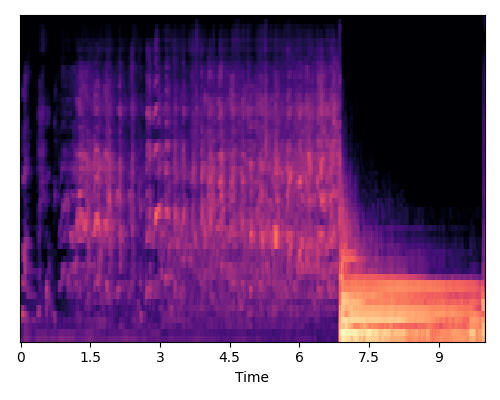

# 
 Towards Fine-grained Audio Generation with Natural Language Descriptions 

## Abstract
Current Text-to-audio (TTA) models mainly use coarse text descriptions as inputs to generate audio, which hinders models from generating audio with fine-grained control of content and style. Some studies try to improve the granularity by incorporating additional frame-level conditions or control networks. However, this usually leads to complex system design and difficulties due to the requirement for reference frame-level conditions. To address these challenges, we propose AudioComposer, a novel TTA generation framework that relies solely on natural language descriptions (NLDs) to provide both content specification and style control information. To further enhance audio generative modeling, we employ flow-based diffusion transformers with the cross-attention mechanism to incorporate text descriptions effectively into audio generation processes, which can not only simultaneously consider the content and style information in the text inputs, but also accelerate generation compared to other architectures. Furthermore, we propose a novel and comprehensive automatic data simulation pipeline to construct data with fine-grained text descriptions, which significantly alleviates the problem of data scarcity in the area. Experiments demonstrate the effectiveness of our framework using solely NLDs as inputs for content specification and style control. The generation quality and controllability surpass stateof-the-art TTA models, even with a smaller model size. 
The code is available in [AudioComposer-main](https://github.com/lavendery/AudioComposer/tree/main/AudioComposer-main)

## Method

In the following, we will present some samples generated using our AudioComposer.

## AudioCondition test set

| 
 Natural Language Descriptions 
| 
 Tango2 
 | 
 Tango+LControl 
| 
 AudioComposer-S 
| 
 AudioComposer-L 
| 
 Ground Turth 
|
| -------------------------- | ------------------------- | ------------------------- | ------------------------------ | ----------------------------- | ----------------------- |
| “Water tap, faucet", Start at 5.02s, End at 7.32s. “Female speech, woman speaking”, Start at 7.4s, End at 10s. |    <audio src="demo_ASstrong/tango2_strong/Y_iL8G7GTNo0.wav" controls preload></audio>  |    <audio src="demo_ASstrong/v20/Y_iL8G7GTNo0.wav" controls preload></audio> |    <audio src="demo_ASstrong/v8/Y_iL8G7GTNo0.wav" controls preload></audio> |    <audio src="demo_ASstrong/v9/Y_iL8G7GTNo0.wav" controls preload></audio>   |     <audio src="demo_ASstrong/gt/Y_iL8G7GTNo0.wav" controls preload></audio>|
| "Alarm", Start at 0.14s, End at 2.54s. "Alarm", Start at 3.4s, End at 10s. "Male speech, man speaking", Start at 5.24s, End at 10s. |    <audio src="demo_ASstrong/tango2_strong/YKddGbfF5vV8.wav" controls preload></audio>  |    <audio src="demo_ASstrong/v20/YKddGbfF5vV8.wav" controls preload></audio> |    <audio src="demo_ASstrong/v8/YKddGbfF5vV8.wav" controls preload></audio> |    <audio src="demo_ASstrong/v9/YKddGbfF5vV8.wav" controls preload></audio>   |     <audio src="demo_ASstrong/gt/YKddGbfF5vV8.wav" controls preload></audio>|
| "Dishes, pots, and pans", Start at 0.01s, End at 1.14s. "Dishes, pots, and pans", Start at 8.59s, End at 9.27s. |    <audio src="demo_ASstrong/tango2_strong/YkqfSvcebBt0.wav" controls preload></audio>  |    <audio src="demo_ASstrong/v20/YkqfSvcebBt0.wav" controls preload></audio> |    <audio src="demo_ASstrong/v8/YkqfSvcebBt0.wav" controls preload></audio> |    <audio src="demo_ASstrong/v9/YkqfSvcebBt0.wav" controls preload></audio>   |     <audio src="demo_ASstrong/gt/YkqfSvcebBt0.wav" controls preload></audio>|
| "Female speech, woman speaking", Start at 0s, End at 0.63s. |    <audio src="demo_ASstrong/tango2_strong/Yy0AYIpO7uVE.wav" controls preload></audio>  |    <audio src="demo_ASstrong/v20/Yy0AYIpO7uVE.wav" controls preload></audio> |    <audio src="demo_ASstrong/v8/Yy0AYIpO7uVE.wav" controls preload></audio> |    <audio src="demo_ASstrong/v9/Yy0AYIpO7uVE.wav" controls preload></audio>   |     <audio src="demo_ASstrong/gt/Yy0AYIpO7uVE.wav" controls preload></audio>|
| "Cutlery, silverware", Start at 3.91s, End at 5.2s. |    <audio src="demo_ASstrong/tango2_strong/YQASgXRMPKwY.wav" controls preload></audio>  |    <audio src="demo_ASstrong/v20/YQASgXRMPKwY.wav" controls preload></audio> |    <audio src="demo_ASstrong/v8/YQASgXRMPKwY.wav" controls preload></audio> |    <audio src="demo_ASstrong/v9/YQASgXRMPKwY.wav" controls preload></audio>   |     <audio src="demo_ASstrong/gt/YQASgXRMPKwY.wav" controls preload></audio>|
| “Female speech, woman speaking”, Start at 0s, End at 2.68s. "Blender”, Start at 4.24s, End at 10s. |    <audio src="demo_ASstrong/tango2_strong/YhEm2oWVXj3g.wav" controls preload></audio>  |    <audio src="demo_ASstrong/v20/YhEm2oWVXj3g.wav" controls preload></audio> |    <audio src="demo_ASstrong/v8/YhEm2oWVXj3g.wav" controls preload></audio> |    <audio src="demo_ASstrong/v9/YhEm2oWVXj3g.wav" controls preload></audio>   |     <audio src="demo_ASstrong/gt/YhEm2oWVXj3g.wav" controls preload></audio>|

## AudioTPE test set

Pitch and energy are divided into three levels: low / normal / high. You can distinguish the category according to the normal pitch and normal energy of the reference pitch & energy

| 
 Natural Language Descriptions 
| 
 Tango2 
 | 
 Tango+LControl 
| 
 AudioComposer-S 
| 
 AudioComposer-L 
| 
 Ground Turth 
| 
 Reference Pitch&Energy 
|
| -------------------------- | ------------------------- | ------------------------- | ------------------------------ | ----------------------------- | ----------------------- |  ------------- |
| "dog bark”, Start at 0s, End at 3.43s, it has Low Pitch and High Energy. "Yell, human shout”, Start at 3.43s, End at 10s, it has High Pitch and Normal Energy". |    <audio src="demo_clean/tango2_clean/mix_157.wav" controls preload></audio>  |    <audio src="demo_clean/v31/mix_157.wav" controls preload></audio> |    <audio src="demo_clean/v8/mix_157.wav" controls preload></audio> |    <audio src="demo_clean/v9/mix_157.wav" controls preload></audio>   |     <audio src="demo_clean/gt/mix_157.wav" controls preload></audio>| dog bark: <audio src="demo_clean/refer_normal_pitch_energy/dog_bark.wav" controls preload></audio>   Yell: <audio src="demo_clean/refer_normal_pitch_energy/yell.wav" controls preload></audio> |
| “Cheering, shout", human group”, Start at 0s, End at 8.43s, it has Normal Pitch and Normal Energy. "Explosion", Start at 8.43s, End at 10s, it has Normal Pitch and Normal Energy. |    <audio src="demo_clean/tango2_clean/mix_61.wav" controls preload></audio>  |    <audio src="demo_clean/v31/mix_61.wav" controls preload></audio> |    <audio src="demo_clean/v8/mix_61.wav" controls preload></audio> |    <audio src="demo_clean/v9/mix_61.wav" controls preload></audio>   |     <audio src="demo_clean/gt/mix_61.wav" controls preload></audio>| Cheering: <audio src="demo_clean/refer_normal_pitch_energy/cheering.wav" controls preload></audio>   Explosion: <audio src="demo_clean/refer_normal_pitch_energy/explosion.wav" controls preload></audio> |
| "Drill, power tool", Start at 0s, End at 3.7s, it has Normal Pitch and Normal Energy. "keyboard typing", Start at 3.7s, End at 8.09s, it has High Pitch and Normal Energy. "Dog", Start at 8.09s, end at 10s, it has Low Pitch and Low Energy. |    <audio src="demo_clean/tango2_clean/mix_147.wav" controls preload></audio>  |    <audio src="demo_clean/v31/mix_147.wav" controls preload></audio> |    <audio src="demo_clean/v8/mix_147.wav" controls preload></audio> |    <audio src="demo_clean/v9/mix_147.wav" controls preload></audio>   |     <audio src="demo_clean/gt/mix_147.wav" controls preload></audio>| Drill: <audio src="demo_clean/refer_normal_pitch_energy/drill.wav" controls preload></audio>   keyboard: <audio src="demo_clean/refer_normal_pitch_energy/keyboard.wav" controls preload></audio>   Dog: <audio src="demo_clean/refer_normal_pitch_energy/dog_domestic.wav" controls preload></audio> |
| "Laughter", Start at 0s, End at 6.88s, it has Low Pitch and Low Energy. "Piano, keyboard_(musical)", Start at 6.88s, End at 10s, it has Low Pitch and Normal Energy. |    <audio src="demo_clean/tango2_clean/mix_5.wav" controls preload></audio>  |    <audio src="demo_clean/v31/mix_5.wav" controls preload></audio> |    <audio src="demo_clean/v8/mix_5.wav" controls preload></audio> |    <audio src="demo_clean/v9/mix_5.wav" controls preload></audio>   |     <audio src="demo_clean/gt/mix_5.wav" controls preload></audio> | Laughter: <audio src="demo_clean/refer_normal_pitch_energy/laughter.wav" controls preload></audio>   Piano: <audio src="demo_clean/refer_normal_pitch_energy/piano.wav" controls preload></audio> |

## AudioCaps test set
The FAD is slightly worse because we did not use the relative pressure-based data augmentation strategies proposed in Tango.

<table>
  <tr>
    <th rowspan="2" style="text-align:center">Model</th>
    <th rowspan="2" style="text-align:center">#Params</th>
    <th colspan="3" style="text-align:center">Objective Metrics</th>
  </tr>
  <tr>
    <td style="text-align:center">FD&darr;</td>
    <td style="text-align:center">KL&darr;</td>
    <td style="text-align:center">FAD&darr;</td>
  </tr>
  <tr>
    <td>
AudioLDM-L-Full
</td>
    <td>
739M
</td>
    <td>
32.46
</td>
    <td>
1.76
</td>
    <td>
4.18
</td>
  </tr>
  <tr>
    <td>
AudioLDM 2-Full
</td>
    <td>
346M
</td>
    <td>
-
</td>
    <td>
1.62
</td>
    <td>
2.18
</td>
  </tr>
  <tr>
    <td>
AudioLDM 2-Full-Large
</td>
    <td>
712M
</td>
    <td>
-
</td>
    <td>
1.54
</td>
    <td>
2.11
</td>
  </tr>
  <tr>
    <td>
Tango
</td>
    <td>
866M
</td>
    <td>
24.52
</td>
    <td>
1.37
</td>
    <td>
1.59
</td>
  </tr>
  <tr>
    <td>
Tango 2
</td>
    <td>
866M
</td>
    <td>
-
</td>
    <td>
1.12
</td>
    <td>
2.69
</td>
  </tr>
  <tr>
    <td>
AudioComposer-S
</td>
    <td>
272M
</td>
    <td>
27.57
</td>
    <td>
1.76
</td>
    <td>
3.63
</td>
  </tr>
  <tr>
    <td>
AudioComposer-L
</td>
    <td>
742.79M
</td>
    <td>
19.25
</td>
    <td>
1.39
</td>
    <td>
2.52
</td>
  </tr>
</table>

AudioCaps Demo

| 
 Natural Language Descriptions 
| 
 Tango 
 | 
 AudioComposer-S 
| 
 AudioComposer-L 
| 
 Ground Turth 
|
| -------------------------- | ------------------------- |------------------------------ | ----------------------------- | ----------------------- |
| An emergency siren wailing followed by a large truck engine running idle | <audio src="demo_audiocaps/tango/Y6TO9PEGpZcQ.wav" controls preload></audio>  | <audio src="demo_audiocaps/v8/Y6TO9PEGpZcQ.wav" controls preload></audio> | <audio src="demo_audiocaps/v9/Y6TO9PEGpZcQ.wav" controls preload></audio> | <audio src="demo_audiocaps/gt/Y6TO9PEGpZcQ.wav" controls preload></audio> | 
| A man speaks as food sizzles followed by some cracks | <audio src="demo_audiocaps/tango/Y_9mgOkzm-xg.wav" controls preload></audio>  | <audio src="demo_audiocaps/v8/Y_9mgOkzm-xg.wav" controls preload></audio> | <audio src="demo_audiocaps/v9/Y_9mgOkzm-xg.wav" controls preload></audio> | <audio src="demo_audiocaps/gt/Y_9mgOkzm-xg.wav" controls preload></audio> | 
| A train sounds horn while the engine taps | <audio src="demo_audiocaps/tango/Y0yETgW44MZU.wav" controls preload></audio>  | <audio src="demo_audiocaps/v8/Y0yETgW44MZU.wav" controls preload></audio> | <audio src="demo_audiocaps/v9/Y0yETgW44MZU.wav" controls preload></audio> | <audio src="demo_audiocaps/gt/Y0yETgW44MZU.wav" controls preload></audio> | 
| A man speaks with others speaking in the distance and traffic passing with a few horns honking | <audio src="demo_audiocaps/tango/Y5K1mISHwggI.wav" controls preload></audio>  | <audio src="demo_audiocaps/v8/Y5K1mISHwggI.wav" controls preload></audio> | <audio src="demo_audiocaps/v9/Y5K1mISHwggI.wav" controls preload></audio> | <audio src="demo_audiocaps/gt/Y5K1mISHwggI.wav" controls preload></audio> | 